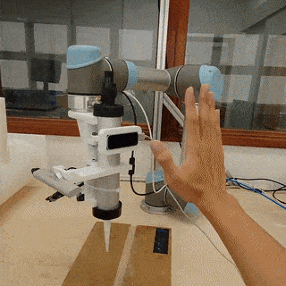

# Robotic Welding Human-Robot Interaction

## Requirements

- Leap Motion SDK & Drivers
  - the ./lib in this repo specifies windows drivers, please add your own if running Linux/Mac
- Custom URX Python Package from https://github.com/jkur/python-urx/tree/SW3.5/urx
  - Because the one from pip is not updated :(
- Python 2.7
- Everything in `requirements.txt`

## Interaction Workflow

1. Robot is stopped
   1. Wave to the Leap Motion sensor to enable 'positioning' mode
   2. 'Positioning' mode is a fast 1 DOF (yaw) robot control mode that tracks your palm position and normal and is used to quickly position the robot close to the groove to be welded
2. Robot is positioning
   1. Make a peace sign to start 'scanning mode'
   2. 'Scanning' mode is a slower 2 DOF (yaw & pitch) robot that tracks your palm position, normal and fingers' direction to accurately maneuver the robot to scan a 3D point cloud of the groove.
3. Robot is scanning
   1. When done scanning, close your hand into a fist to stop scanning.

